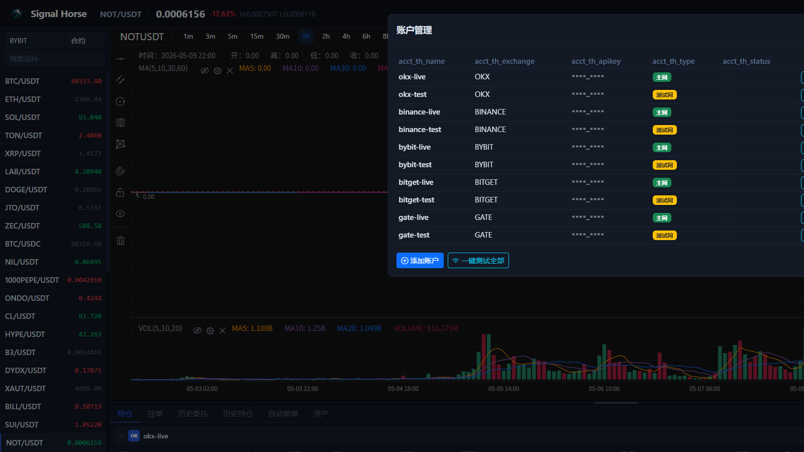

# 账户管理窗口

账户管理窗口是你接入交易所账户、区分测试网和主网、批量测连通性的主入口。

## 这个窗口负责什么

- 查看已经保存的账户。
- 区分主网账户和测试网账户。
- 添加新账户。
- 编辑已有账户。
- 单独测试某个账户。
- 批量测试全部账户。
- 删除不再使用的账户。

## 建议的使用顺序

1. 第一次先只加一个测试网账户。
2. 保存后立刻做测试连接。
3. 再去资产、持仓和历史页做只读验证。
4. 最后才做最小下单。

## 日常最常见的操作

- 新增一个测试网账户做练习。
- 更新过期的 API Key。
- 批量复测所有账户是否仍可用。
- 删除已经废弃的账户配置。

## 使用建议

- 不要先把所有实盘账户一口气加进去。
- `OKX` 和 `Bitget` 这类需要 `passphrase` 的交易所，要确认字段填完整。
- 只要环境不确定，就先用测试网账户验证。

下一步建议看 [添加账户](add-account.md) 或 [资产页](assets-tab.md)。