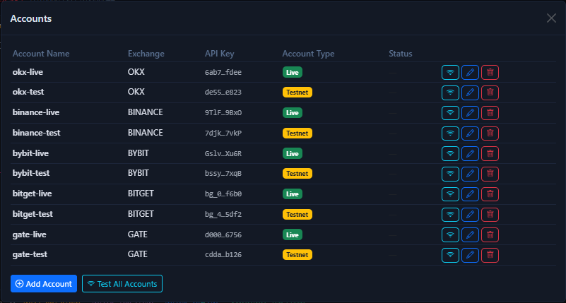

# Add Accounts

This page focuses on one thing only: how to connect an account through the UI and confirm that it can read balances, read positions, and pass a connection test.

## Where to enter this flow

1. Open the local UI.
2. Click the `Accounts` button in the top-right area.
3. In the account management window, click `Add Account`.

If you want a field-by-field explanation of the buttons and form in that window, read [Account Center](account-center.md) first.

If this is your first trial, adding just one testnet account is enough.

## Supported exchanges and field differences

| Exchange | Requires `passphrase` | Notes |
| --- | --- | --- |
| OKX | Yes | It is best to validate connectivity in simulated trading first |
| Binance | No | Spot testnet and futures testnet are separate systems |
| Bybit | No | Demo / testnet is supported |
| Bitget | Yes | UTA accounts are the better fit at the moment |
| Gate.io | No | Spot and swap balances may behave like they share a pool |

## Recommendations before creating API keys

- Do not enable withdrawal permission.
- Grant only the minimum trading permissions needed.
- Prefer testnet or demo environments for the first connection.
- If an exchange uses different test credentials for spot and swap, do not mix them.

## Adding an account in the UI

Recommended flow:

1. Enter the local UI.
2. Click `Accounts` at the top.
3. Click `Add Account` in the modal.
4. Select the exchange.
5. Fill in `API Key` and `Secret Key`.
6. For `OKX` or `Bitget`, also fill in `Passphrase`.
7. Choose whether the account is live or testnet.
8. After saving, run a connection test first.

## What to check immediately after adding it

Do not place an order immediately after saving. Check these three things first:

1. Whether the account label correctly shows live or testnet.
2. Whether the balances page can read data.
3. Whether positions, order history, or position history can return data.

If all three are normal, proceed to manual trading.

## Batch testing all accounts

The account window provides a `Test All` action, which is useful in these situations:

- You just imported accounts from several exchanges.
- You are not sure which ones are live and which ones are testnet.
- You updated one API key and want to re-check everything together.

Before a batch test, make sure the API permissions of those accounts are themselves correct.

## How to think about testnet versus live

Under the current project conventions:

- Accounts marked as `testnet` should be used first for validation and practice.
- Accounts marked as `live` should only be used after you have already confirmed the workflow.

!!! warning "Do not assume one credential set covers every environment"
    Some exchanges split spot testnet, swap testnet, and live API access into separate credential systems. Whenever a read API reports a permission error, check whether the environment and key actually match before assuming the product is wrong.

## Checklist after adding an account

After adding an account, complete at least these three checks:

1. Read balances.
2. Read positions.
3. Read order history or position history.

Once all three succeed, continue to [Manual Trading](manual-trading.md).

If you later need scripted access to saved accounts, go to [API Appendix (Advanced)](../reference/api.md).