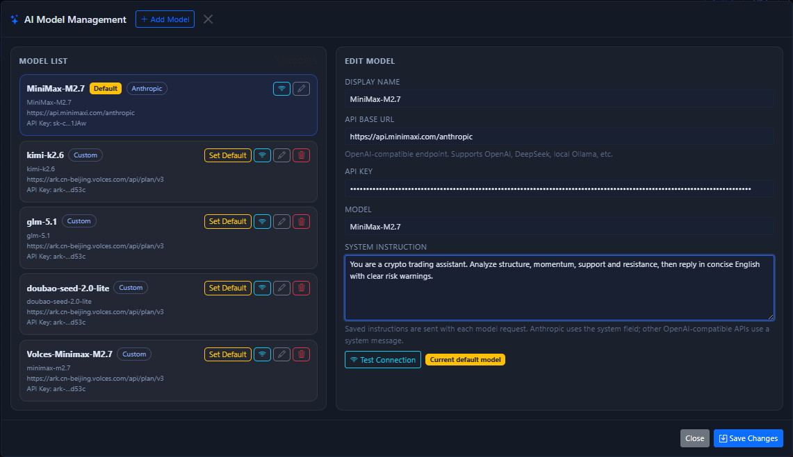

# AI and Automation

TradeArk is not just a manual trading page. It also provides a local execution surface for AI workflows and automated tasks.

## Two common usage modes

### 1. AI analysis with human confirmation

This mode is suitable for new users:

- AI analyzes the market and generates suggestions.
- You inspect the side, quantity, leverage, and TP / SL in the UI.
- You manually confirm the final execution.

### 2. AI analysis driving automated Bots

This mode is suitable for users who have already validated accounts, market setup, and risk controls:

- Configure an AI provider first.
- Let the local UI or scripts call the analysis flow.
- Use Bot tasks to monitor the market on a schedule and execute strategy logic.

## The first two things to do in the UI

If you mainly use AI through the interface, start with these two steps:

1. Click the top `AI` button and enter the model management window.
2. Test model connectivity first, then decide whether to make it the default model.

If you want a field-by-field introduction to that window, go directly to [AI Model Center](ai-model-center.md).

AI analysis and auto-trade are only meaningful after the model connection is working.

## What the AI model management window can do

From the window shown in the screenshot, the most common functions are:

- Review the models that are currently configured.
- Add a new model.
- Set the default model.
- Test connectivity for a specific model.
- Modify the API base URL, API key, model name, and system instruction.
- Save changes.

## Common configuration items for automated Bots

Based on the current UI, automated tasks usually revolve around these items:

- Exchange and accounts
- One or more symbols
- Timeframe / trigger frequency
- Capital size
- Leverage and margin mode
- TP / SL strategy
- Cooldown time, risk thresholds, and direction constraints

Multi-symbol Bots can usually define an individual allocation ratio for each symbol instead of forcing an equal split.

## AI entry points inside the chart area

In addition to the top `AI` button, the chart area also contains AI-related quick entries in the bottom-right corner. They are better suited for these workflows:

- Launching analysis quickly for the current symbol.
- Running multiple models on the same market for comparison.
- Entering automation flows directly from the chart.

If you want to see what each button, loading state, and result card looks like, go directly to [Bottom-Right AI Analysis](ai-chart-analysis.md).

If you already have an AI result and want to see what appears after clicking the result card, which values are auto-filled, and what happens after confirmation, go directly to [AI Quick Order Modal](ai-quick-order.md).

If you want the full startup workflow for the chart-side `One-Click Auto Trade` button, go directly to [One-Click Auto Trade](auto-trade-launcher.md).

For day-to-day use, automatic tasks are mainly reviewed and managed from the bottom [Auto Trade Tab](auto-trade-tab.md).

If you are still new to the product, treat AI as an extra observation layer first, not as something that should decide everything for you.

## Facts you must confirm before automation

!!! warning "Do not skip this step"
    Before enabling automation, you must manually verify:

    1. Account permissions are correct.
    2. The testnet path is correct.
    3. The symbol and market type are correct.
    4. Manual orders can succeed.
    5. TP / SL really works in your target exchange environment.

## Recommended rollout order

1. Read-only mode: start by reading market data only.
2. AI suggestion mode: let AI suggest, but do not auto-submit orders.
3. Small-scale automation on testnet: run Bots only in testnet.
4. Small live rollout: start with the minimum capital size.
5. Scale symbol count and capital only after stability is proven.

## Automation usage advice

- In fixed-capital mode, treat `positionSize` as the total capital pool of the strategy, not as an infinitely expandable single-trade size.
- Any statistics panel is only a reference. Real fills and realized PnL should always be confirmed against exchange responses and history.
- When markets move violently, prioritize cross-checking automation logs against order history.

## Boundaries when connecting external AI tools

If you connect TradeArk to OpenClaw, Claude Code, Codex, or any other local agent workflow, keep this boundary in mind:

- Prefer storing credentials inside the local executor.
- When possible, use `account_id` instead of sending raw keys on every request.
- Start with read-only permissions on the AI side and expand write access gradually.

Only when you need scripted AI integration or an external tool workflow should you revisit [API Appendix (Advanced)](../reference/api.md).