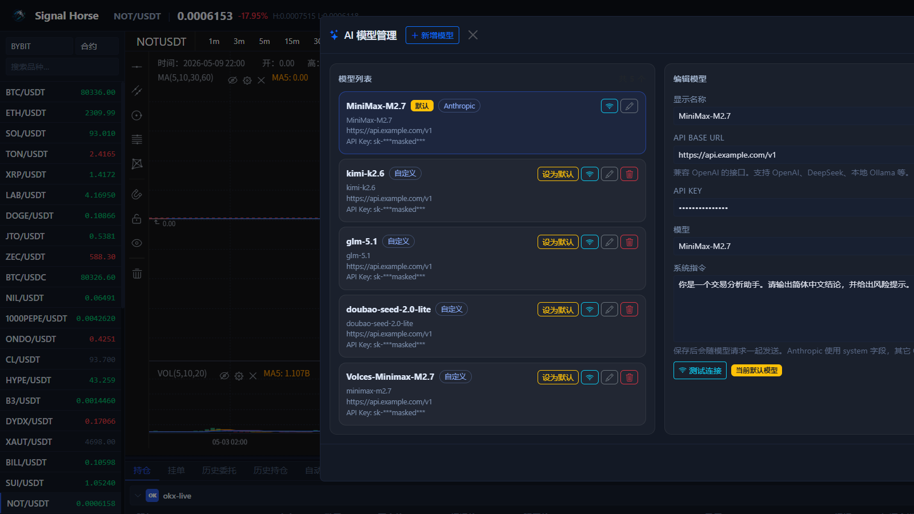

# AI 与自动化

TradeArk 不只是一个手动下单页面，它也提供面向 AI 工作流和自动化任务的本地执行面。

## 两类常见用法

### 1. AI 分析但人工确认执行

适合刚开始使用的人：

- AI 负责分析行情和生成建议。
- 你在 UI 中检查方向、数量、杠杆、TP/SL。
- 最后手动点击执行。

### 2. AI 分析并驱动自动化 Bot

适合已经验证过账户、市场和风控策略的人：

- 先设置 AI Provider。
- 让本地 UI 或脚本调用分析流程。
- 通过 Bot 任务周期性检查行情并执行策略。

## 在 UI 里先做哪两件事

如果你主要通过界面使用 AI，先做这两步：

1. 点击顶部 `AI` 按钮，进入模型管理窗口。
2. 先测试模型连接，再决定是否把它设成默认模型。

如果你想先逐项认识这个窗口的字段和按钮，直接看 [AI 模型窗口](ai-model-center.md)。

只有模型连接正常后，图表上的 AI 分析和自动做单才有意义。

## AI 模型管理窗口能做什么

从截图中的窗口，你通常会用到这些功能：

- 查看当前有哪些模型配置。
- 新增模型。
- 设置默认模型。
- 测试某个模型的连接是否正常。
- 修改 API Base URL、API Key、模型名和系统指令。
- 保存修改。

## 自动化 Bot 的常见配置项

根据当前 UI 能力，自动化任务通常会围绕这些项展开：

- 交易所与账户
- 单个或多个交易对
- 周期 / 触发频率
- 资金规模
- 杠杆与保证金模式
- TP / SL 策略
- 冷却时间、风控阈值和方向限制

多标的 Bot 通常可以为每个 symbol 设置独立分配比例，而不是只能平均分仓。

## 图表区里的 AI 入口

除了顶部 `AI` 按钮，图表区右下角也有 AI 相关的快捷入口。它更适合做这些事：

- 对当前交易对快速发起分析。
- 同时用多个模型分析同一标的。
- 从图表直接进入自动做单相关入口。

如果你想看这部分每个按钮、加载过程和结果卡片分别长什么样，直接看 [右下角 AI 分析](ai-chart-analysis.md)。

如果你已经拿到了 AI 结果，想看结果卡片点下去之后会出现什么、哪些值会自动带入、确认后又会发生什么，直接看 [AI 快捷下单窗口](ai-quick-order.md)。

如果你想看图表区里那颗 `一键自动看盘做单` 按钮的完整启动流程，直接看 [一键自动做单](auto-trade-launcher.md)。

自动任务在日常使用里主要会回到底部 [自动做单页](auto-trade-tab.md) 做查看和管理。

如果你只是新手，建议先把 AI 当作“给出观察角度”的辅助层，而不是直接替你做决定。

## 自动化前必须先确认的事实

!!! warning "不要跳过这一步"
    自动化之前，你必须先人工验证：

    1. 账户权限正确。
    2. 测试网链路正确。
    3. 交易对和市场类型正确。
    4. 手动单可以成功。
    5. TP / SL 在你的目标交易所环境里确实有效。

## 推荐的上线顺序

1. 只读模式：先只做市场数据读取。
2. AI 建议模式：让 AI 给建议，但不自动发单。
3. 测试网小额自动化：只在测试网运行 Bot。
4. 实盘小额灰度：先用最小资金试运行。
5. 稳定后再扩大资金规模和标的数量。

## 自动化使用建议

- 固定资金模式下，把 `positionSize` 当成策略总资金池，而不是单次无限放大的仓位参数。
- 任何统计面板都只能作为参考，真正的成交与盈亏以交易所回报和历史记录为准。
- 当市场剧烈波动时，优先用自动化日志和订单历史交叉核对执行情况。

## 对接 AI 工具时的边界

如果你把 TradeArk 接给 OpenClaw、Claude Code、Codex 或其他本地代理流程，请遵守这条边界：

- 优先把密钥保存在本地执行器中。
- 能用 `account_id` 就尽量不要在每次请求里重复传密钥。
- AI 侧先做只读，再逐步开放写权限。

只有当你要做脚本化 AI 接入或外部工具对接时，才建议再回看 [API 附录（高级）](../reference/api.md)。