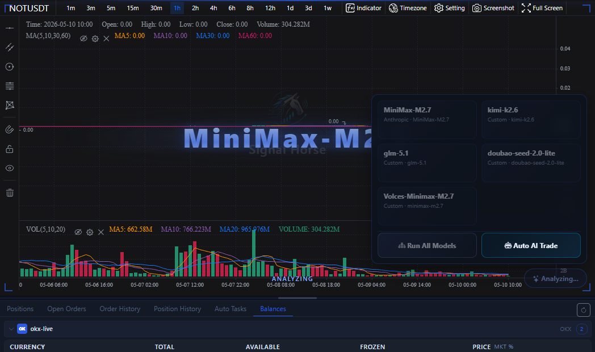
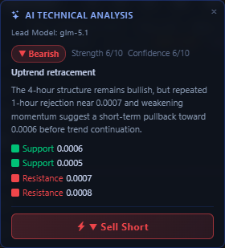

# Bottom-Right AI Analysis

This button group is the fastest analysis entry point inside the chart area. It is designed for the workflow “look at the current symbol first, then immediately ask a model for a technical judgment”, instead of detouring through the top settings dialog.

## What the entry looks like

This entry group has three layers of use:

- Click a single model card to analyze the current symbol with just one model.
- Click `Analyze with All Models` to compare multiple runnable models on the same market.
- Click `One-Click Auto Trade` to enter the automatic task launcher directly.

!!! tip "Two trigger styles"
    The small bottom-right `AI` button can trigger the default analysis directly. Hovering over it expands the full menu, which is better when you want to choose a model explicitly or open automation.

## What happens after analysis starts

After analysis starts, the chart area enters a waiting state. You will usually see:

- The bottom-right AI button switch into a loading state.
- A scanning-style visual overlay on the chart.
- The current symbol and timeframe remain unchanged, and the result is added back onto the current chart when it returns.

This step may take a few seconds or much longer, depending on the model provider, network conditions, and current queue length. Do not keep clicking multiple models during loading, or it becomes difficult to tell which request produced the final result.

## How to read the result card

After analysis completes, a result card appears on the left side of the chart. It usually contains:

- `Primary model`: which model was actually used for the final output.
- `Bullish / Bearish / Neutral`: the direction judgment from AI.
- `Strength`: a numeric reference for how strong that view is.
- `Pattern`: a structural label such as continuation, pullback, or consolidation.
- `Summary`: a compressed human-readable conclusion based on multi-timeframe and indicator context.
- `Support / Resistance`: the key price areas worth watching next.

## What the bottom button on the card means

The `Quick Long` or `Quick Short` button at the bottom of the result card does not bypass confirmation and send an order immediately.

It opens the [AI Quick Order Modal](ai-quick-order.md) and pre-fills:

- The direction suggested by AI
- The current default leverage
- TP / SL reference values inferred from support and resistance
- The currently selected accounts, or one default account if none was selected before

But one important detail remains: `Quantity` is not filled in automatically. You still need to review and enter it yourself.

In other words, this step is closer to “use AI output to fill the form faster”. Whether the order is actually submitted is still decided inside the order modal.

## A safer order of use

1. Confirm that the exchange, market type, symbol, and timeframe on the left side are already correct.
2. Run one model you trust first, and see whether the direction and summary make sense.
3. Then decide whether to click `Analyze with All Models` for cross-checking.
4. Only if the result broadly matches your own chart reading should you proceed to the quick-order or auto-trade flow.

## When you should not follow it directly

- You have not confirmed whether the current account is a testnet account.
- You have not successfully completed one normal manual order yet.
- You only looked at the AI conclusion and did not review the chart structure and bottom history tabs.

Next, go to [AI Quick Order Modal](ai-quick-order.md), [One-Click Auto Trade](auto-trade-launcher.md), or [Manual Trading](manual-trading.md).