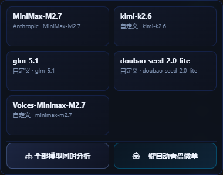
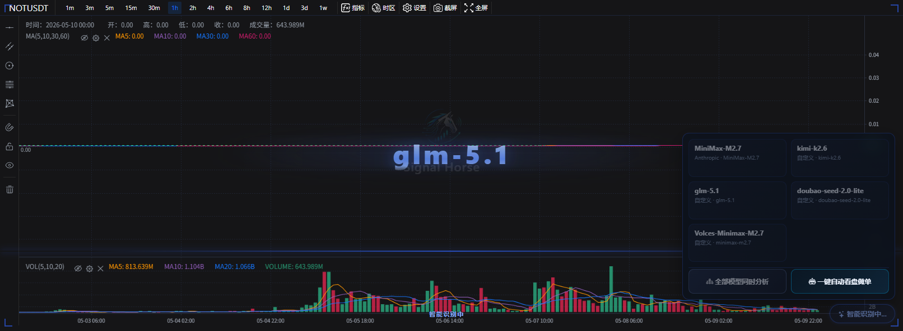
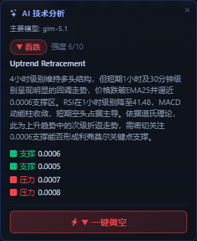

# 右下角 AI 分析

这组按钮是图表区里最快的分析入口。它适合做“先看当前 symbol，再立刻调模型给出技术判断”，而不是先去顶部配置页绕一圈。

## 入口长什么样

右下角这一组入口有三层用途：

- 点击单个模型卡片，只用一个模型分析当前交易对。
- 点击 `全部模型同时分析`，让多个可运行模型同时给出观点。
- 点击 `一键自动看盘做单`，直接进入自动任务启动弹窗。

!!! tip "两种触发方式"
    右下角小 `AI` 按钮可以直接触发默认分析；把鼠标移上去则会展开完整菜单，适合明确选择模型或进入自动做单。

## 分析开始后会发生什么

开始分析后，图表区会进入等待状态。你通常会看到：

- 右下角 AI 按钮进入加载态。
- 图表上出现扫描中的视觉反馈。
- 当前 symbol 和周期保持不变，结果返回后直接叠加在图表上。

这一步可能只要几秒，也可能更久，取决于模型提供方、网络和当前排队情况。不要在加载中连续重复点击多个模型，否则你很难判断最后是哪次请求返回了结果。

## 结果卡片怎么读

分析完成后，图表左侧会出现结果卡片。它通常包含这些信息：

- `主要模型`：这次分析最终采用的是哪个模型。
- `看涨 / 看跌 / 中性`：AI 给出的当前方向判断。
- `强度`：当前观点强弱的量化参考。
- `形态名`：例如趋势延续、回调、盘整等结构描述。
- `摘要`：把多周期和指标判断压缩成一段可读结论。
- `支撑 / 压力`：给出当前更值得盯住的关键价格区间。

## 卡片底部按钮是什么意思

结果卡片底部的 `一键做多` 或 `一键做空`，不是直接绕过确认把单子发出去。

它会打开 [AI 快捷下单窗口](ai-quick-order.md)，并自动带入：

- AI 给出的方向
- 当前默认杠杆
- 从支撑 / 压力推出来的 TP / SL 参考值
- 当前已选中的账户，或默认选择一个账户

但有一个关键点要记住：`数量` 默认不会帮你填好，仍然需要你自己确认后输入。

也就是说，这一步更像“用 AI 结果快速填表”，最后是否真的提交，仍然由你在下单窗口里确认。

## 更稳妥的使用顺序

1. 先确认左侧交易所、市场类型、交易对和周期已经选对。
2. 只跑一个你信任的模型，先看它的方向和摘要是否合理。
3. 再决定要不要点 `全部模型同时分析` 做交叉对比。
4. 如果结果和你的图表观察基本一致，再考虑进入 AI 快捷下单或自动做单。

## 什么时候不该直接照着做

- 你还没确认当前是不是测试网账户。
- 你还没跑通过一次普通手动下单。
- 你只看了 AI 结论，没有回看图表结构和底部历史记录。

下一步建议看 [AI 快捷下单窗口](ai-quick-order.md)、[一键自动做单](auto-trade-launcher.md) 或 [手动交易](manual-trading.md)。