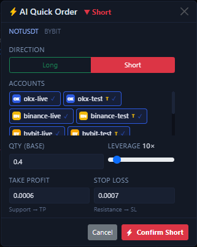

# AI Quick Order Modal

This modal is the confirmation layer between the AI result card and a real order submission. Its value is not to skip judgment for you, but to pre-fill the direction and price references that AI already inferred so you do not have to type everything again.

## Where this modal comes from

When you receive a result card in [Bottom-Right AI Analysis](ai-chart-analysis.md), clicking `Quick Long` or `Quick Short` at the bottom opens this modal.

- If AI is biased bullish, the modal defaults to `Long`.
- If AI is biased bearish, the modal defaults to `Short`.
- If you disagree with the AI direction, you can still switch it manually at the top of the modal.

## Which values are filled automatically

This modal will try to fill these values for you first:

- The current `symbol` and exchange.
- The direction inferred by AI.
- The current default leverage.
- TP / SL reference prices derived from support and resistance.
- The accounts that are currently selected; if none were selected before, one available account is selected for you.

In the current implementation, when you switch the side from `Short` back to `Long`, the TP / SL values are recalculated accordingly. It is not just a color change on the button.

## Which values you must still confirm yourself

The easiest thing to misunderstand is this: `Quantity` is not filled automatically.

Before submitting, you still need to confirm at least these items yourself:

- What quantity should actually be used.
- Whether only the accounts you want are still selected.
- Whether the leverage matches the current market and the account permissions.
- Whether the TP / SL references fit your own risk boundary.

If you select multiple accounts at once, the confirmation button does not mean “place one order only”. It will execute account by account for everything you selected.

## What exactly happens after you confirm

After you click the confirmation button at the bottom, the system works in this order:

1. It submits a market open order for each selected account, one by one.
2. For accounts where the open succeeded, it waits briefly and then sends TP / SL in a separate step.
3. It aggregates the success and failure results back into the current modal.

This leads to one important fact: `open order succeeded` and `TP / SL succeeded` are not the same atomic action.

If an account opens successfully but the later TP / SL step fails, the modal will clearly report a partial success instead of pretending the whole process completed cleanly.

## What you will see during submission

Once submission starts, a real-time log panel expands on the right side of the modal. It is useful for identifying exactly where the process is stuck:

- Which account is currently sending an open order.
- Which account already opened successfully.
- Where TP / SL succeeded or failed.
- Whether the final outcome was full success, partial success, or total failure.

If everything succeeds, the UI automatically switches to the [Positions Tab](positions-tab.md) so you can verify the result. If there is a partial failure, the modal stays open so you can continue reading the log and adjusting the input.

## Recommended first-time usage

1. Keep only one testnet account selected first.
2. Enter a very small quantity manually and confirm you did not misunderstand the unit or side.
3. Do not treat AI-provided TP / SL as mandatory values. Check them against the chart first.
4. After submission, immediately reconcile against [Positions Tab](positions-tab.md) and [Order History Tab](order-history-tab.md).

!!! warning "This is not no-confirmation trading"
    The AI quick-order modal only makes form filling faster. It does not remove the need to confirm quantity, account selection, and risk assumptions yourself.

Next, continue with [Right Order Panel](order-panel.md) or [One-Click Auto Trade](auto-trade-launcher.md).