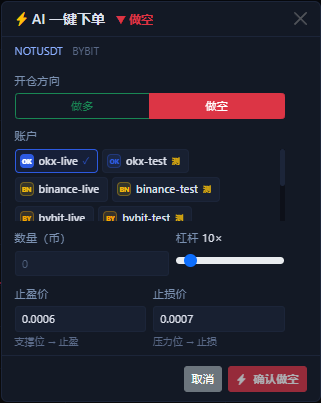

# AI 快捷下单窗口

这个窗口是 AI 结果卡片和真实下单之间的“确认层”。它的价值不是替你跳过判断，而是把 AI 已经推出来的方向和价格参考先填到表单里，让你少重复输入一遍。

## 这个窗口从哪里来

当你在 [右下角 AI 分析](ai-chart-analysis.md) 里拿到结果卡片后，点击底部的 `一键做多` 或 `一键做空`，就会打开这个窗口。

- 如果 AI 判断偏多，窗口会默认切到 `做多`。
- 如果 AI 判断偏空，窗口会默认切到 `做空`。
- 如果你不同意 AI 给的方向，也可以在窗口顶部手动切换方向。

## 哪些内容会自动带进来

这个窗口会优先替你填好这些内容：

- 当前正在看的 `symbol` 和交易所。
- AI 推断出来的方向。
- 当前默认杠杆。
- 根据支撑 / 压力推出来的 TP / SL 参考价。
- 当前已经选中的账户；如果你之前没选账户，就先帮你勾上一个可用账户。

在当前实现里，方向一旦从 `做空` 切回 `做多`，TP / SL 也会跟着重新换位，而不是只改按钮颜色。

## 哪些内容必须你自己确认

最容易误解的一点是：`数量` 默认不会自动填写。

你在提交前至少还要自己确认这几项：

- 数量到底填多少。
- 账户是不是只保留了你想操作的那几个。
- 杠杆是否和当前市场、账户权限一致。
- TP / SL 参考值是否真的符合你自己的风险边界。

如果你一次选了多个账户，确认按钮并不代表“只下一笔单”，而是会按你勾选的账户逐个执行。

## 点确认后到底会发生什么

点击底部确认按钮后，系统会按这个顺序做事：

1. 先对每个已选账户逐个提交市价开仓。
2. 对开仓成功的账户，稍等片刻后再单独补发 TP / SL。
3. 把成功和失败结果汇总到当前窗口里。

这意味着一个重要事实：`开仓成功` 和 `TP / SL 成功` 不是同一笔原子操作。

如果某个账户开仓成功了，但后续 TP / SL 失败，窗口会明确把它显示成部分成功，而不是假装一切都完成了。

## 提交时你会看到什么

开始提交后，窗口右侧会展开实时日志面板。它适合用来判断到底卡在了哪一步：

- 是哪个账户正在发起开仓。
- 哪个账户已经开仓成功。
- TP / SL 是在哪个账户上补成功或补失败。
- 最终是全部成功、部分成功，还是全部失败。

如果全部成功，界面还会自动切到 [持仓页](positions-tab.md) 帮你核对结果；如果存在部分失败，窗口会保留在原地，方便你继续看日志和调整。

## 第一次使用时的推荐方式

1. 先只保留 1 个测试网账户。
2. 手动填一个很小的数量，确认单位和方向没看反。
3. 不要把 AI 给出的 TP / SL 原样当成必须值，先看一眼图表位置。
4. 提交后立即去 [持仓页](positions-tab.md) 和 [历史委托页](order-history-tab.md) 对账。

!!! warning "这不是免确认下单"
    AI 快捷下单只是帮你把表单预填得更快，不会替你绕过数量确认、账户选择和风险判断。

下一步建议看 [右侧下单面板](order-panel.md) 或 [一键自动做单](auto-trade-launcher.md)。