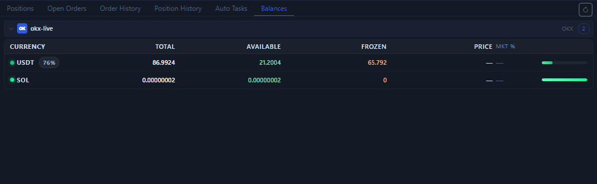

# Assets Tab

The `Assets` tab answers one of the most basic questions: how much usable capital is left in the current account, and how is it roughly distributed across assets?

## What this tab shows

- Asset lists grouped by account.
- Total, available, and frozen balances for each asset.
- Current price and estimated value share.
- The main capital distribution within the account.

## When to check this tab first

1. Before placing an order.
2. After placing an order, when you want to confirm whether balances changed.
3. When you want to know whether enough available funds remain.

## The most practical uses of this tab

- Confirm whether available funds are enough to open a position.
- Observe whether capital is frozen by open orders or positions.
- Quickly see which asset currently holds the largest share of capital.

## Things to watch while reading it

- Some assets may not have a current market price, in which case the field may appear blank or as a dash.
- The assets tab is a balance view, not a positions view.
- Frozen balances often mean there are still open orders, trigger orders, or other active locks.

Next, continue with [Positions Tab](positions-tab.md) or [Manual Trading](manual-trading.md).