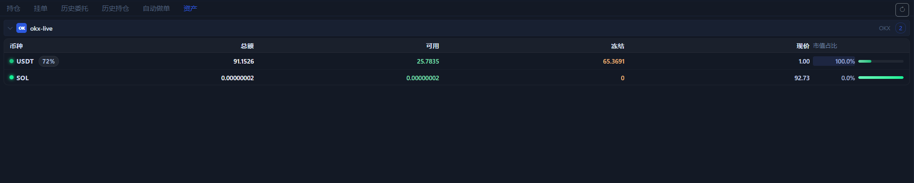

# 资产页

`资产` 页用来回答一个最基础的问题：你当前账户里到底还有多少可用资金，以及这些资金大概分布在哪些币种上。

## 这一页会显示什么

- 按账户分组的资产列表。
- 每个币种的总额、可用、冻结。
- 当前价格和市值占比。
- 账户内主要资金分布。

## 什么时候先看这页

1. 你准备下单之前。
2. 你下完单之后，想确认余额是否变化。
3. 你要判断是不是还有足够的可用资金时。

## 这页最实用的用途

- 确认可用资金够不够开仓。
- 观察是否有资金被挂单或仓位冻结。
- 快速看出主资金目前集中在哪个币种。

## 读这页时要注意

- 个别币种可能没有现价，这时会显示为空或破折号。
- 资产页是余额视角，不等于持仓页的仓位视角。
- 冻结资金常常意味着还有挂单、条件单或其他占用。

下一步建议看 [持仓页](positions-tab.md) 或 [手动交易](manual-trading.md)。