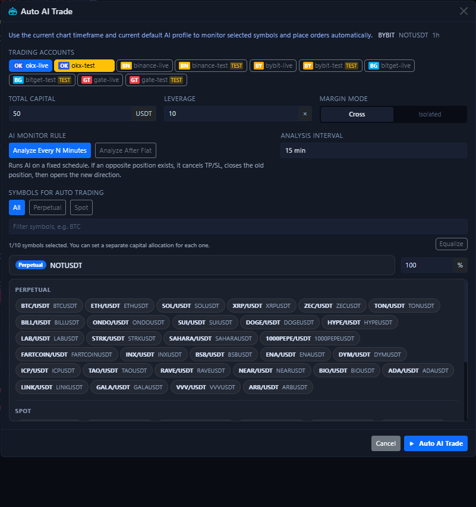
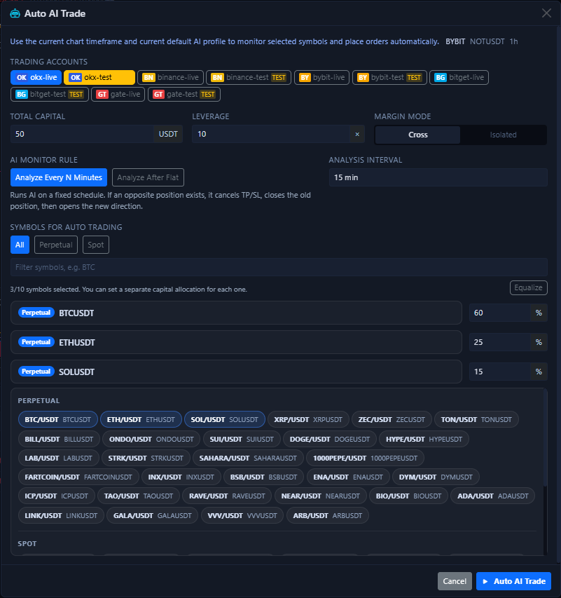

# One-Click Auto Trade

`One-Click Auto Trade` is the quick launcher inside the bottom-right AI menu of the chart area. It is not “place one market order for me right now”. It is “create and start automatic tasks quickly for the current symbol, current timeframe, and the accounts you selected”.

## What the launch dialog looks like

This dialog puts the most frequently used startup parameters on one screen:

- Account selection
- Total capital
- Leverage
- Margin mode
- AI monitoring rule
- Analysis timeframe
- Symbol filtering and multi-symbol selection
- Capital allocation percentage per symbol

The line at the top, such as `BYBIT / NOTUSDT / 1h`, is not decoration. It means the launcher is inheriting the exchange, symbol, and timeframe that your chart is currently showing.

## What multi-symbol mode looks like

If you want to monitor more than one market, this dialog can become a multi-symbol launcher directly:

- You can select up to 10 symbols at once.
- Each symbol can have its own capital allocation ratio.
- The `Rebalance` button in the top-right can redistribute the currently selected symbols evenly.
- Switching between `Swap / Spot` only changes the filter scope. It does not silently rewrite allocations you already set.

## What this step really does

When you click the start button at the bottom, the system creates or reuses Bot tasks for the selected accounts and symbols, and starts them automatically.

This means:

- It does not analyze only once and stop.
- It does not place only one order and stop.
- If you selected accounts from multiple exchanges, the system splits them into exchange-specific tasks.
- If a symbol cannot be matched on the target exchange, it is skipped instead of forcing the wrong task to be created.
- After a successful launch, the UI opens the Bot detail panel first so you can inspect logs and parameters immediately. After that, you return to the bottom [Auto Trade Tab](auto-trade-tab.md) for ongoing management.

## These parameters matter the most

### Accounts

Select only testnet accounts first. Once too many accounts are involved, troubleshooting becomes much harder.

If you select multiple accounts at the same time, the system does not merge them into one vague task. It splits them by exchange.

### Total capital

This is closer to “the total capital pool available to this automatic task”, not an unlimited per-trade position cap.

If you select multiple symbols, this total capital is further divided according to the allocation ratios below.

### Leverage

This is the default leverage written into the automatic task when it is created. It does not mean every future order can bypass exchange or account limits. If the requested leverage is outside the permitted range, the final result still depends on the exchange response.

### Margin mode

- `Cross` is more suitable for early testing because it is easier to reason about and less fragmented.
- `Isolated` is better when you explicitly want risk separation per position.

### AI monitoring rule

- `Fixed interval analysis`: keep checking on a fixed minute cadence.
- `Analyze again after flat`: wait until the previous position is closed before starting the next cycle.

If you are still validating the workflow, prefer `Fixed interval analysis` because the rhythm is easier to predict.

### Analysis timeframe

This decides which timeframe the automatic task will keep using after startup. It should usually match the timeframe shown in the chart when you launch it, unless you have a clear reason to separate them.

### Symbol selection and allocation ratios

You can choose one symbol or several. If you choose several, do not forget to review the percentage split for each symbol. Do not assume the default numbers automatically match your intent.

If this is your first trial, keep only one symbol selected instead of filling all 10 slots immediately.

## Where to verify after launch

After a successful launch, the Bot detail panel usually appears first. That is your first place to review the initial logs, parameters, and next analysis time.

Then return to the bottom [Auto Trade Tab](auto-trade-tab.md) and verify three things:

- Whether the task was really created.
- Whether the current state is `running`, `analyzing`, or `stopped`.
- Whether profit, win rate, and next analysis time are changing normally.

If you need to adjust more detailed parameters later, enter the detailed settings for the corresponding task from the action buttons on the right side of the task list.

## Recommended first-time usage

1. Select only one testnet account.
2. Select only one symbol.
3. Use minimal capital and relatively low leverage.
4. Let it run for a while and observe task state plus history.
5. Only after that should you gradually increase the number of symbols and the capital size.

!!! warning "Do not treat it as one-click managed trading"
    The value of this button is that it accelerates task startup. It does not remove the need to confirm account permissions, market type, leverage, TP / SL, or exchange-specific differences.

Next, continue with [Auto Trade Tab](auto-trade-tab.md) or [AI and Automation](ai-automation.md).