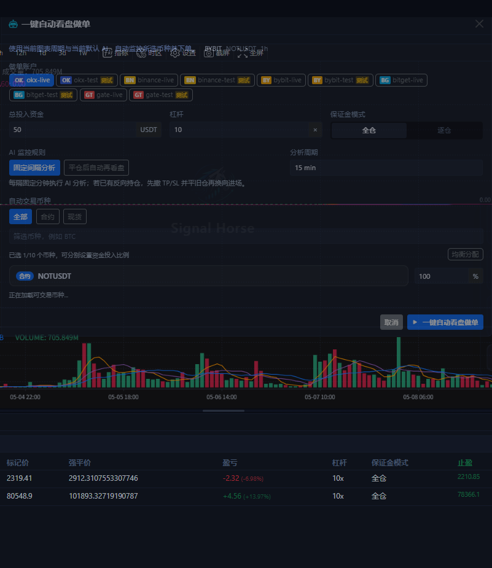
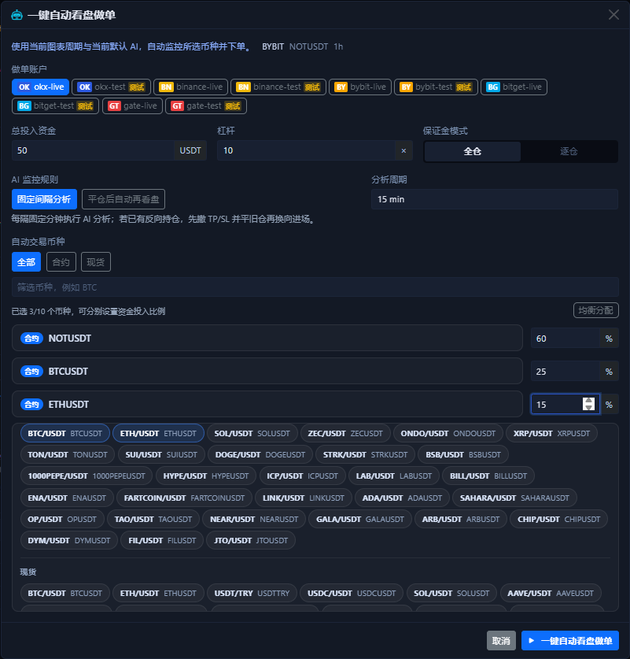

# 一键自动做单

`一键自动看盘做单` 是图表区右下角 AI 菜单里的快速启动器。它不是“立刻帮你下一笔市价单”，而是“按当前 symbol、当前周期和你选的账户，快速创建并启动自动任务”。

## 启动弹窗长什么样

这个弹窗把最常用的启动参数集中在一页里：

- 账户选择
- 总投入资金
- 杠杆
- 保证金模式
- AI 监控规则
- 分析周期
- 交易对筛选与多 symbol 选择
- 每个 symbol 的资金分配比例

顶部这行 `BYBIT / NOTUSDT / 1h` 不是装饰，它说明这次启动器默认继承的是你当前图表正在看的交易所、交易对和周期。

## 选多个 symbol 时是什么样

当你不只盯一个交易对时，这个弹窗可以直接变成多 symbol 启动器：

- 最多同时选 10 个 symbol。
- 每个 symbol 都可以单独改资金分配比例。
- 右上角 `均衡分配` 可以把当前已选标的重新平均。
- `合约 / 现货` 切换只影响筛选范围，不会自动替你改掉已经选中的分配比例。

## 这一步真正会做什么

点击底部启动按钮后，系统会按你选中的账户和 symbol 创建或复用 Bot 任务，并自动启动它们。

这意味着：

- 它不是只分析一次就结束。
- 它也不是只下一次单就结束。
- 如果你同时选了多个交易所账户，系统会按交易所拆成各自的任务。
- 如果某个 symbol 在目标交易所找不到可匹配的市场，它会被跳过，而不是强行建错任务。
- 启动成功后，界面会先自动打开 Bot 详细面板，方便你立刻看日志和参数；之后再回到底部 [自动做单页](auto-trade-tab.md) 做持续管理。

## 这几个参数最重要

### 账户

先只选测试网账户。账户一多，排查问题会明显变难。

如果你同时勾了多个账户，系统不是把它们糊成一个任务，而是会按交易所拆分处理。

### 总投入资金

这里更接近“这个自动任务可用的总资金池”，不是单次无限放大的仓位上限。

如果你选了多个 symbol，这笔总资金会再按下面的分配比例拆给各个标的。

### 杠杆

这里是自动任务创建时写入的默认杠杆，不代表以后每次都会绕过交易所限制强制成交。超出交易所或账户允许范围时，最终还是会以交易所返回为准。

### 保证金模式

- `全仓` 更适合先做测试，切换频率低，排查也相对直接。
- `逐仓` 适合你明确知道想把风险隔离到单个仓位时再使用。

### AI 监控规则

- `固定间隔分析`：按固定分钟数持续检查。
- `平仓后自动再看盘`：更偏向等上一笔结束后再决定下一轮。

如果你刚开始验证链路，优先用 `固定间隔分析`，因为节奏更容易预测。

### 分析周期

这里决定自动任务之后按哪个时间框架反复做分析。它和你启动这一刻图表顶部的周期应当一致，除非你有明确理由要分开。

### symbol 选择和分配比例

你可以选一个 symbol，也可以选多个。选多个时，别忘了检查每个 symbol 的百分比分配，不要默认它一定符合你的资金意图。

如果你只是第一次试跑，建议先保留 1 个 symbol，不要一上来就把 10 个名额用满。

## 启动后去哪里确认

启动成功后，通常会先弹出 Bot 详细面板；那是你看首轮日志、参数和下一次分析时间的第一现场。

随后再回到底部 [自动做单页](auto-trade-tab.md) 看三件事：

- 任务是不是已经创建出来。
- 当前是 `运行中`、`分析中` 还是 `已停止`。
- 收益、胜率、下次分析时间是否在正常变化。

如果你后面要继续改更细的参数，就从任务列表右侧的操作按钮进入对应任务的详细设置。

## 推荐的第一次使用方式

1. 只选 1 个测试网账户。
2. 只选 1 个 symbol。
3. 用最小资金和较低杠杆。
4. 先跑一段时间观察任务状态和历史记录。
5. 没问题后再逐步增加 symbol 数量和资金规模。

!!! warning "不要把它当成一键托管"
    这个按钮的价值是“加快你启动自动任务”，不是替你跳过风控。账户权限、市场类型、杠杆、TP / SL、交易所差异，仍然都需要你自己确认。

下一步建议看 [自动做单页](auto-trade-tab.md) 或 [AI 与自动化](ai-automation.md)。