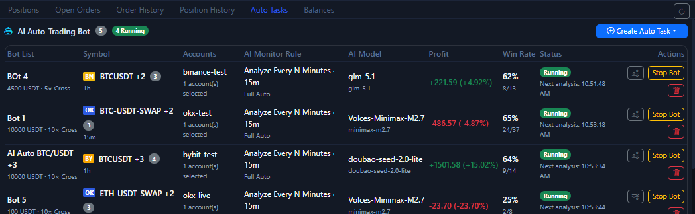

# Auto Trade Tab

The `Auto Trade` tab is the main day-to-day management entry point for Bot tasks. It is not only about creation. It is about reviewing the current state, checking returns, checking status, and starting or stopping tasks.

If you want to create an automatic task first from the bottom-right chart button, read [One-Click Auto Trade](auto-trade-launcher.md) first. This page is more about “how to keep checking and managing tasks after they already exist”.

## What you can see on this page

- How many automatic tasks currently exist.
- Which tasks are running.
- Which symbols and accounts are bound to each task.
- Which AI model, monitoring rule, and timeframe are being used.
- Returns, win rate, recent status, and action buttons.

## The most common actions here

- Create a new automatic task.
- Stop the current bot.
- Restart a stopped task.
- Delete a task you no longer need.
- Confirm whether a newly launched chart-side task is really running.

## When it makes sense to start using this page

1. You have already completed at least one successful manual trading validation.
2. You have already confirmed that account reads, history, and TP / SL behavior are broadly normal.
3. You have already passed AI model connection testing first.

## Usage suggestions

- Run automatic tasks on testnet first.
- Start with a single account, a single symbol, and a small capital size.
- Returns and win rate are only summary layers. You still need to look back at order history and position history.

!!! warning "Do not treat auto trade as a no-check switch"
    Automatic tasks only run your rules faster. They do not remove issues caused by account permissions, market type, or exchange-specific differences.

Next, continue with [AI Model Center](ai-model-center.md) and [AI and Automation](ai-automation.md).