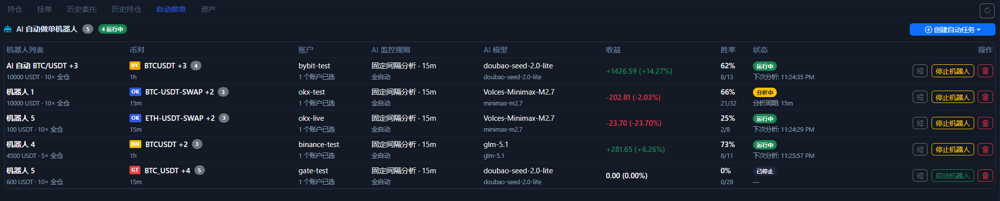

# 自动做单页

`自动做单` 页是日常管理 Bot 任务的主入口。它不是只负责创建，而是负责看现状、看收益、看状态、做启动和停止。

如果你要先从图表右下角那颗按钮创建自动任务，先看 [一键自动做单](auto-trade-launcher.md)。这一页更偏向“任务创建后怎么持续查看和管理”。

## 这一页能看到什么

- 当前一共有多少自动任务。
- 哪些任务正在运行。
- 每个任务绑定了哪些 symbol 和账户。
- 使用了什么 AI 模型、监控规则和周期。
- 收益、胜率、最近状态和操作按钮。

## 这里最常用的动作

- 创建新的自动任务。
- 停止当前机器人。
- 重新启动已停止的任务。
- 删除不再需要的任务。
- 查看刚从图表区启动的新任务是否已经运行起来。

## 什么时候才建议开始用这页

1. 你已经完成过至少一次手动下单验证。
2. 你已经确认账户读取、历史记录和 TP / SL 行为基本正常。
3. 你已经先把 AI 模型连接测试通过。

## 使用建议

- 先在测试网跑自动任务。
- 先从单账户、单 symbol、小资金开始。
- 收益和胜率只是一层汇总，最终还是要回看历史委托和历史持仓。

!!! warning "不要把自动做单当成免检查开关"
    自动任务只是把你的规则跑得更快，不会替你消除账户权限、市场类型或交易所环境差异带来的问题。

下一步建议看 [AI 模型窗口](ai-model-center.md) 和 [AI 与自动化](ai-automation.md)。