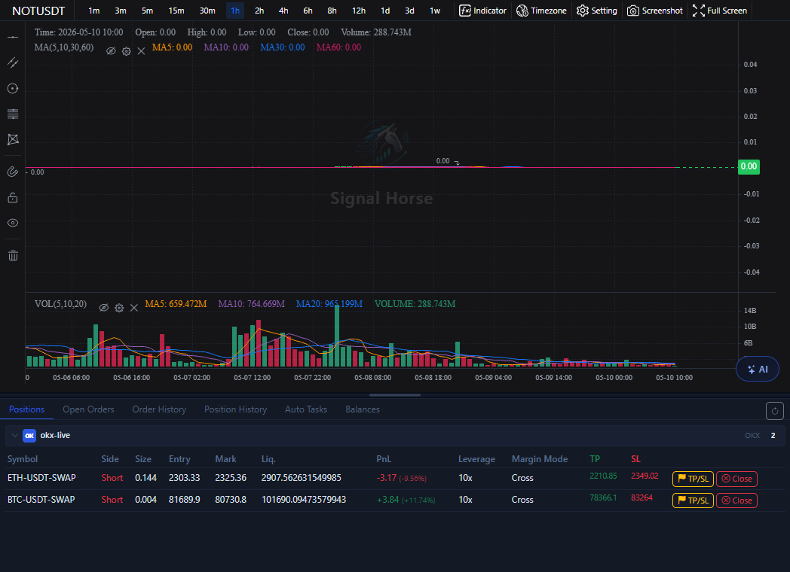

# Chart and Timeframe Tools

The center area is where you make trading judgments. It is mainly responsible for viewing the market, switching timeframes, enabling indicators, and launching AI analysis from the chart.

## What this area contains

- The current symbol title.
- Timeframe buttons such as `1m`, `15m`, `1h`, `4h`, and `1d`.
- Indicators, timezone, settings, screenshot, and fullscreen tools.
- The main chart and volume area.
- The bottom-right AI quick entry.

## How beginners should use it the first time

1. First confirm that the exchange, market type, and symbol in the left area are correct.
2. Switch to the timeframe you know best, such as `15m` or `1h`.
3. Check whether both the main chart and the volume area are updating normally.
4. Open indicators or AI analysis only when needed.

## The most common functions here

- Switch timeframes to compare short-term and mid-term structure.
- Enable indicators to assist with trend and volume analysis.
- Save evidence of the current chart using the screenshot button.
- Temporarily enlarge the chart with fullscreen mode.
- Launch AI analysis for the current symbol from the bottom-right quick entry.

If you want to study the bottom-right button group and result card in detail, go directly to [Bottom-Right AI Analysis](ai-chart-analysis.md). If you want to see how the result card leads into the order modal, go directly to [AI Quick Order Modal](ai-quick-order.md). If you want to start automation from here, go directly to [One-Click Auto Trade](auto-trade-launcher.md).

## Usage suggestions

- Use the chart as your judgment entry point before you move to the right-side order panel.
- Confirm the timeframe first, then review AI suggestions. Do not let AI decide the timeframe for you.
- The price environment you see in the chart should always be cross-checked against the bottom history tabs.

Next, continue with [Right Order Panel](order-panel.md) or [AI Model Center](ai-model-center.md).