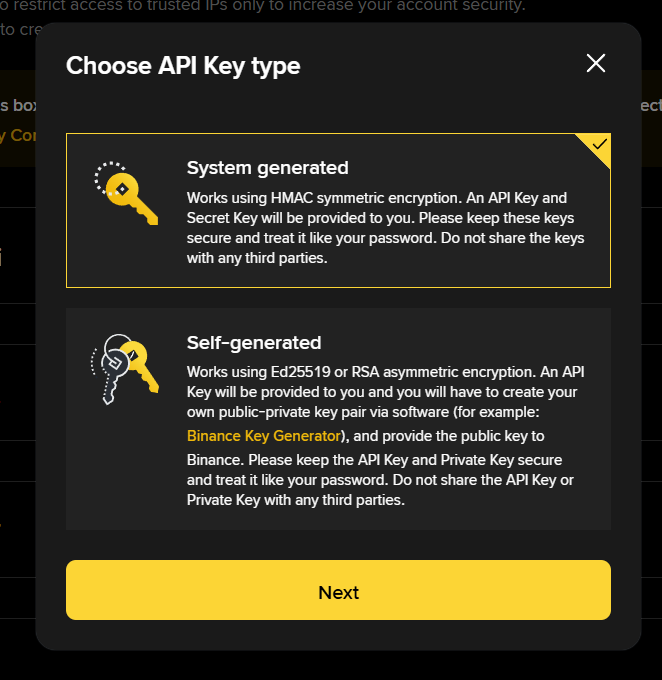
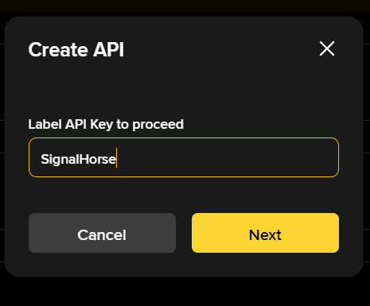
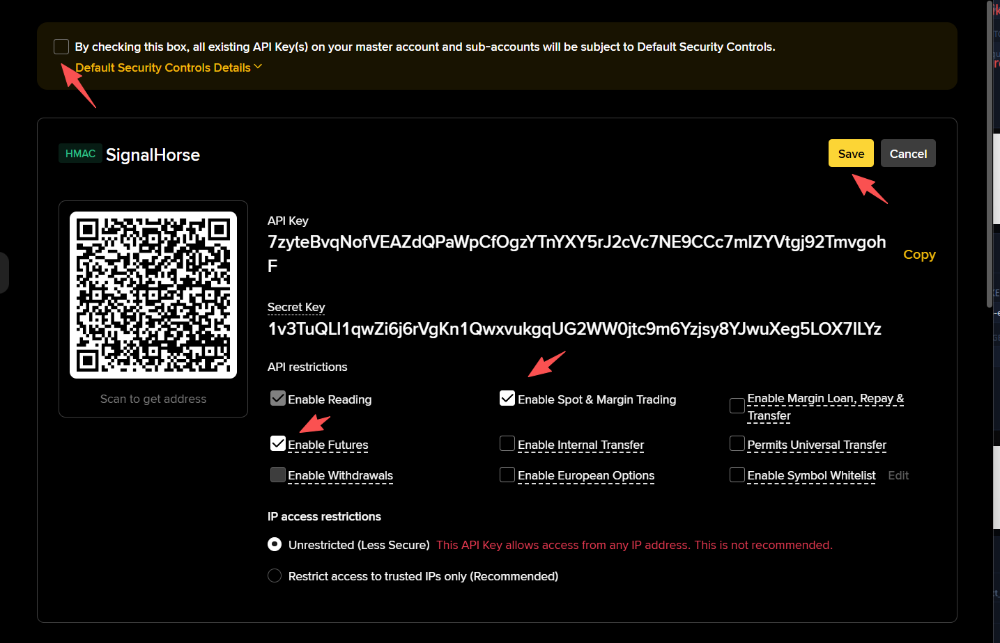

# Binance

Use this page to create a Binance API key for TradeArk.

If you do not already have a Binance account, register here first:

[Binance registration link](https://www.binance.com/join?ref=TradeArk)

Open the Binance API management page here:

`https://www.binance.com/en/my/settings/api-management`

## Create the key

1. Sign in to Binance and start the API creation flow.

2. Choose the system-generated option, then continue and enter an API label for your own reference.

3. Complete the required verification code, email, or 2FA step to create the key.

4. Set the API permissions as shown, keep trading-related permissions only, and save.

After Binance shows the API key and secret, continue to [Add the Keys to TradeArk](TradeArk.md).