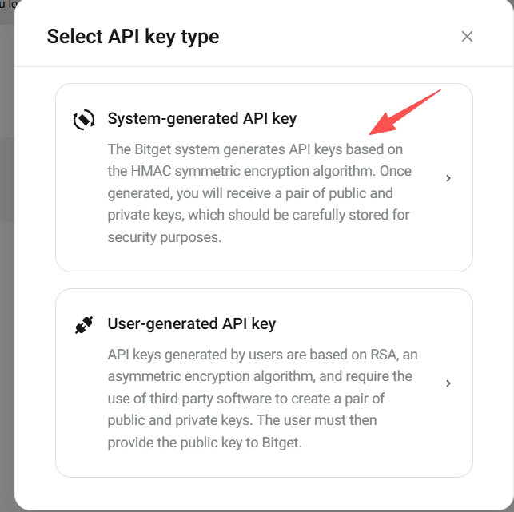
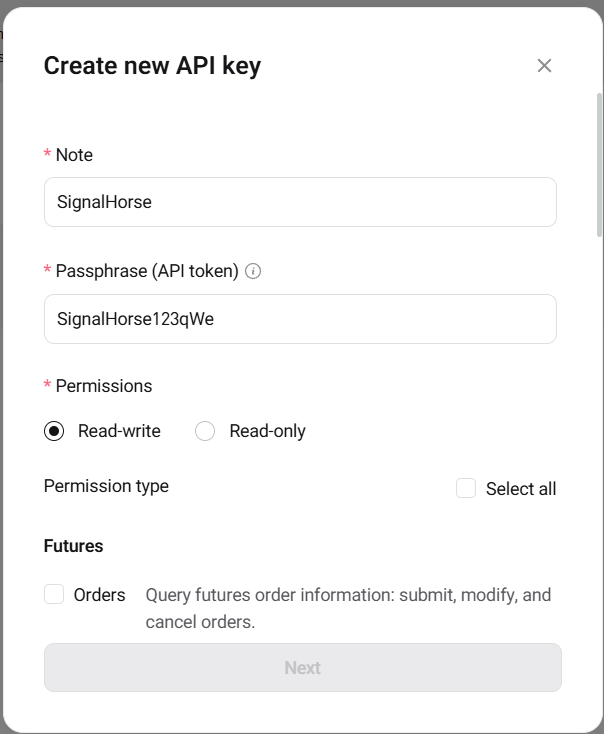
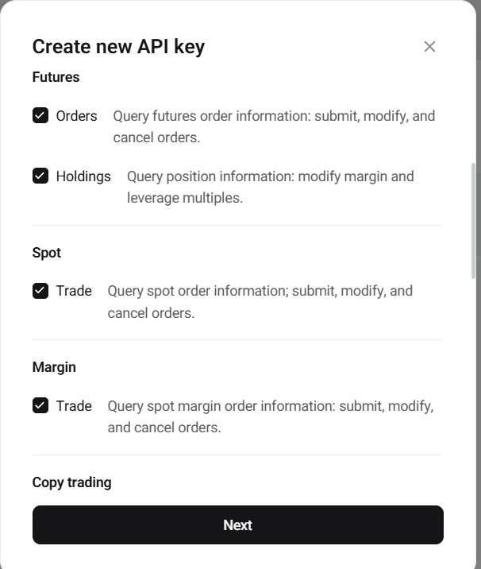
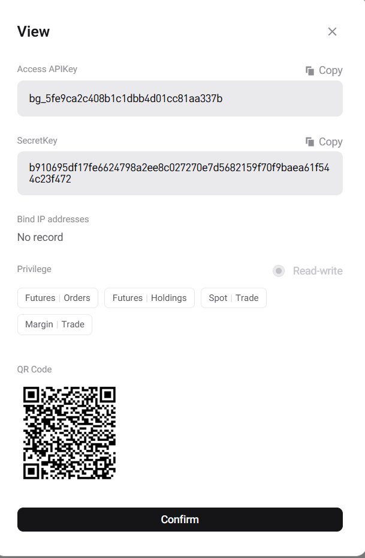

# Bitget

Use this page to create a Bitget API key for TradeArk.

If you do not already have a Bitget account, register here first:

[Bitget registration link](https://partner.bitget.com/bg/signalhors)

Open the Bitget API creation page here:

`https://www.bitget.com/account/newapi`

## Create the key

1. Sign in to Bitget and start the API creation flow.

2. Enter an API remark name and the API password required by Bitget.

3. Enable the necessary spot and swap trading permissions only. Do not enable withdrawal or wallet-transfer-related permissions.

4. Finish the creation and copy the API key and secret key displayed by Bitget.

Bitget also requires the passphrase or API password later in TradeArk, so keep that value with the key pair.

Then continue to [Add the Keys to TradeArk](TradeArk.md).