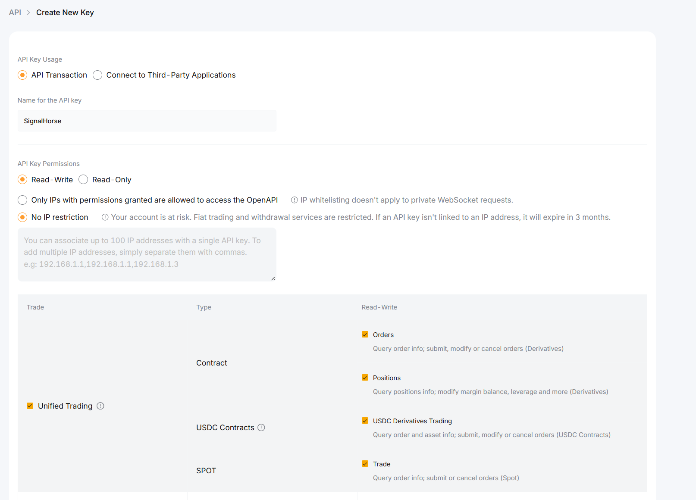
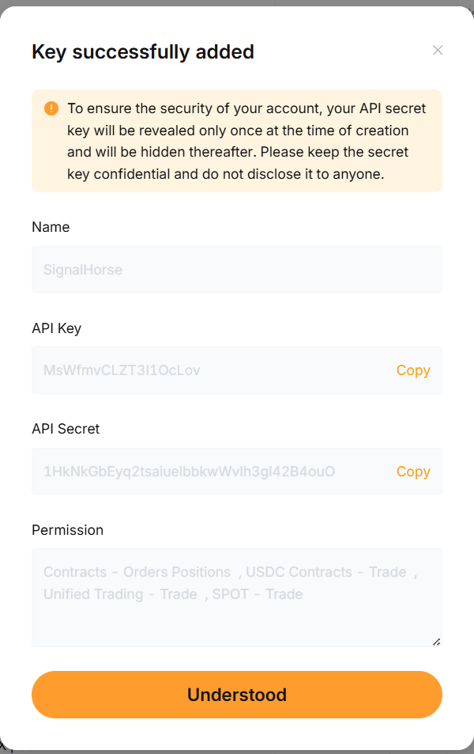

# Bybit

Use this page to create a Bybit API key for TradeArk.

If you do not already have a Bybit account, register here first:

[Bybit registration link](https://www.bybit.com/invite?ref=4LORQ0)

Open the Bybit API management page here:

`https://www.bybit.com/app/user/api-management`

## Create the key

1. Sign in to Bybit and open the API management page.
2. Click the top-right create button and choose the system-generated API key flow.

3. Select the required permissions and finish the key creation.

4. Save the permission setup as shown, then keep the generated API key and secret available for the next step.

After the key is ready, continue to [Add the Keys to TradeArk](TradeArk.md).