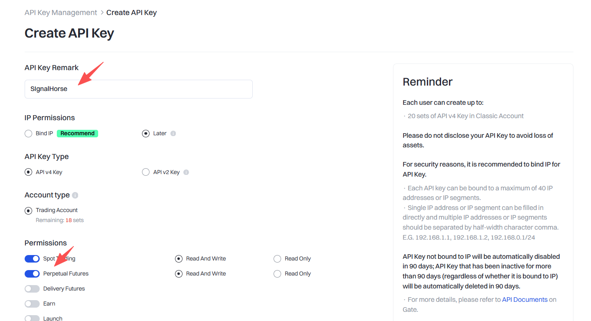
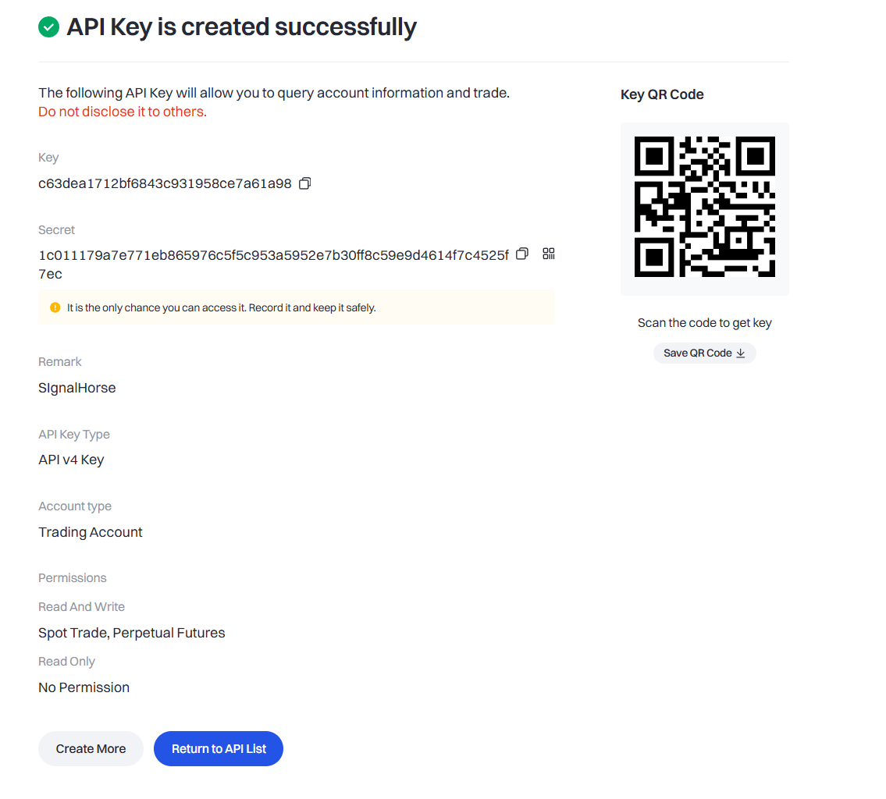

# Gate.io

Use this page to create a Gate.io API key for TradeArk.

If you do not already have a Gate.io account, register here first:

[Gate.io registration link](https://www.gateport.business/share/SIGNALHO)

Open the Gate.io API page here:

`https://www.gate.com/myaccount/profile/api-key/manage`

## Create the key

1. Sign in to Gate.io and click the top-right `Create API Key` action on the API management page.

2. After the API key is created, Gate.io shows the key details page.

3. Set the API permissions as shown, keep only the trading-related permissions you need, and save.

After that, continue to [Add the Keys to TradeArk](TradeArk.md).