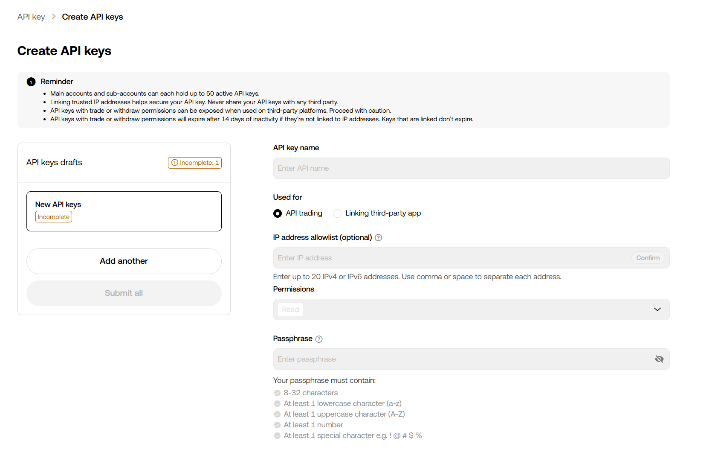
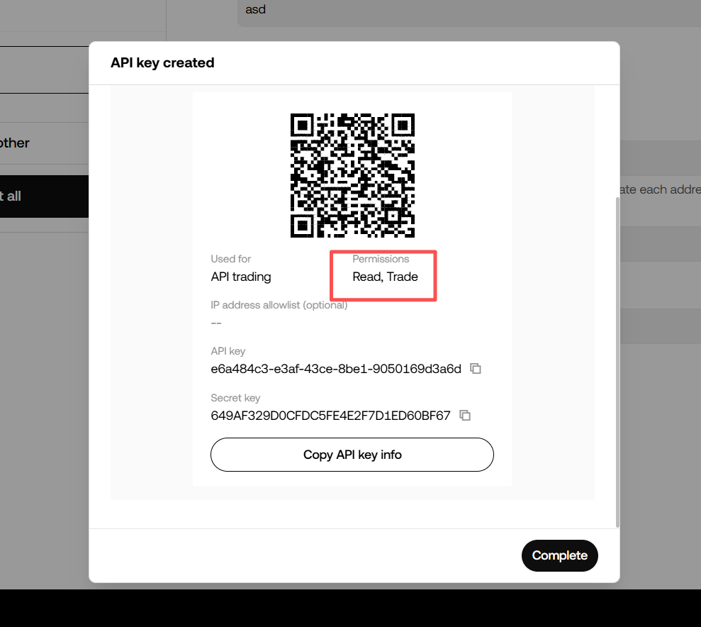

# OKX

这一页演示怎么为 TradeArk 创建 OKX API 密钥。

如果你还没有 OKX 账户，可以先通过这里注册：

[OKX 注册链接](https://www.okx.com/join/TradeArk)

OKX API 创建地址：

`https://www.okx.com/account/my-api/batch-add`

## 创建密钥

1. 登录 OKX 并打开 API 创建页面。
2. 按页面要求填写相关字段，开始创建 API。

3. 如果你是固定 IP 的服务器环境，可以填写 IP 白名单；如果你平时使用会变化的家庭网络或 VPN，这里不要随便限制 IP。
4. 只勾选交易权限，不要开启提现权限。然后按 OKX 要求完成 2FA 或邮箱验证，完成创建。

!!! warning "创建完成后立即复制密钥"
    交易所展示的 API Key 和 Secret Key 都是敏感信息。不要分享截图，不要发给其他人，也不要长时间暴露在屏幕上。

创建完成后，继续看 [接入 TradeArk](TradeArk.md)。