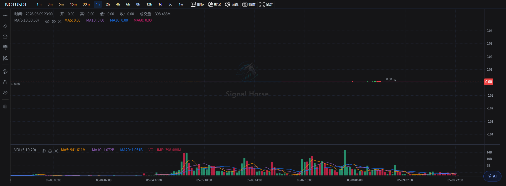

# 接入OKX交易所

下面我们演示接入OKX交易所，请访问以下地址创建api，api创建页面：https://www.okx.com/zh-hans/account/my-api/batch-add

## 这一块包含什么

- 当前 symbol 标题。
- 周期按钮，例如 `1m`、`15m`、`1h`、`4h`、`1d`。
- 指标、时区、设置、截屏、全屏工具。
- 主图和成交量区域。
- 右下角 AI 快捷入口。

## 新手第一次怎么用

1. 先确认左侧交易所、市场类型和交易对已经选对。
2. 把周期切到你最熟悉的时间框架，例如 `15m` 或 `1h`。
3. 观察主图和成交量是否都正常刷新。
4. 需要时再打开指标或 AI 分析。

## 这里最常用的功能

- 切换周期，看短线和中线结构是否一致。
- 打开指标，辅助观察趋势和量能。
- 用截屏按钮保存当前图表证据。
- 用全屏模式临时放大图表。
- 用右下角 AI 快捷入口对当前 symbol 发起分析。

如果你要专门学习右下角这组按钮和结果卡片，直接看 [右下角 AI 分析](ai-chart-analysis.md)；如果你要看结果卡片点下去之后怎么进入下单窗口，直接看 [AI 快捷下单窗口](ai-quick-order.md)；如果你要从这里启动自动化任务，直接看 [一键自动做单](auto-trade-launcher.md)。

## 使用建议

- 先把图表当成判断入口，再去右侧下单。
- 先确认周期，再看 AI 建议，不要让 AI 反过来替你决定周期。
- 图表里看到的价格环境，最终还是要和底部历史记录一起核对。

下一步建议看 [右侧下单面板](order-panel.md) 或 [AI 模型窗口](ai-model-center.md)。