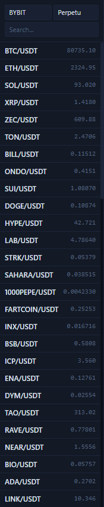

# Markets and Symbols Sidebar

The left sidebar decides which market and which symbol you are actually looking at. Many “why can't I read positions?” or “why is the order result wrong?” issues start here.

## What this area contains

- Exchange selection, such as `OKX`, `BINANCE`, and `BYBIT`.
- Market type selection: `Swap` or `Spot`.
- A search box for filtering symbols quickly.
- A symbol list with the latest price for each symbol.

## Correct order of use

1. Select the exchange first.
2. Then choose `Spot` or `Swap`.
3. Then search for and click the symbol.
4. Only after that should you operate from the right-side order panel.

## Which areas this affects

- The center chart switches to the current symbol.
- The right order panel inherits the current symbol and market type.
- The meaning of verification in the bottom positions, orders, and history tabs also changes with it.

## The most common mistakes

- Reversing `Spot` and `Swap`.
- Switching exchanges but forgetting to confirm the symbol again.
- Searching a symbol and clicking the wrong one when several similar tickers appear.

!!! warning "Always look back here before placing an order"
    Even if the side, leverage, and TP / SL in the right panel are all correct, the final result can be completely different from what you intended if the market type in the left sidebar is wrong.

Next, continue with [Chart and Timeframe Tools](chart-workspace.md) or [Right Order Panel](order-panel.md).