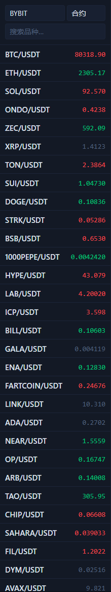

# 市场与交易对侧栏

左侧侧栏决定你当前看的到底是哪一个市场、哪一个交易对。很多“为什么读不到持仓”或“为什么下单结果不对”的问题，根因都在这里。

## 这一栏包含什么

- 交易所选择，例如 `OKX`、`BINANCE`、`BYBIT`。
- 市场类型选择：`合约` 或 `现货`。
- 搜索框，用来快速过滤交易对。
- 交易对列表和每个交易对的最新价格。

## 正确使用顺序

1. 先选交易所。
2. 再选 `现货` 或 `合约`。
3. 再搜索和点击交易对。
4. 最后才去右侧下单区操作。

## 这个区域会影响哪些地方

- 中央图表会切到当前交易对。
- 右侧下单面板会沿用当前交易对和市场类型。
- 底部持仓、挂单、历史页的核对语义也会跟着变化。

## 最常见的错误

- 把 `现货` 和 `合约` 选反了。
- 切了交易所却忘了重新确认交易对。
- 搜索命中多个相似 symbol 时，没点进真正要交易的那个。

!!! warning "下单前一定回看这里"
    右侧面板里的方向、杠杆、TP / SL 再正确，只要左侧市场类型选错，结果就可能完全不是你预期的那笔单。

下一步建议看 [图表与周期工具](chart-workspace.md) 或 [右侧下单面板](order-panel.md)。