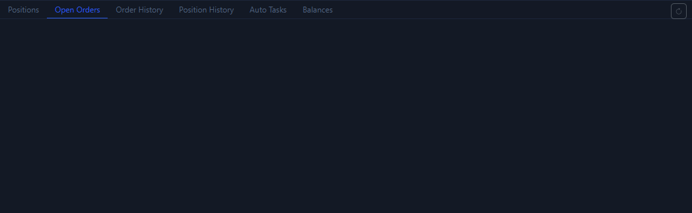

# Open Orders Tab

The `Open Orders` tab is used to confirm orders and trigger orders that are still active. Whenever you use a limit order, trigger order, or TP / SL, this page is worth checking immediately.

## What this tab shows

- Orders that are still active and unfilled.
- TP / SL trigger orders returned by some exchanges.
- The symbol, type, side, price, quantity, and time for each record.
- A per-row `Cancel` button.

## The questions this tab answers best

- Has my order actually been placed on the exchange?
- Has my TP / SL really become active on the exchange side?
- Which orders are still pending and need cancellation or re-submission?

## Typical use cases

1. You just submitted a limit order.
2. You just submitted a trigger order.
3. You just set TP / SL on a position.
4. You are about to perform a one-click cancel and want to confirm what is still active first.

## What to watch when reading this tab

- Some exchanges also place TP / SL entries into the open-orders list, so do not rely on the type text alone. Read price and side together.
- If you know you submitted a limit order but it is not here, the next step is [Order History Tab](order-history-tab.md) to confirm whether it was already filled or rejected.

Next, continue with [Order History Tab](order-history-tab.md) or [Right Order Panel](order-panel.md).