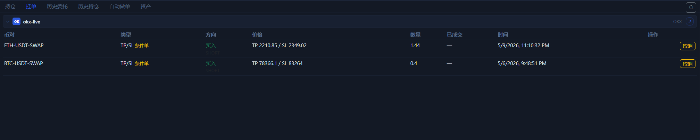

# 挂单页

`挂单` 页用来确认当前还没完成的订单和条件单。只要你用了限价单、条件单或 TP / SL，这一页就值得立刻检查。

## 这一页会显示什么

- 当前仍然有效的未成交订单。
- 某些交易所返回的 TP / SL 条件单。
- 每笔记录的币对、类型、方向、价格、数量、时间。
- 每行自带的 `取消` 按钮。

## 这页最适合回答什么问题

- 我的订单是不是已经挂出去。
- 我的 TP / SL 有没有在交易所侧生效。
- 我现在还有哪些单没有成交、需要取消或重挂。

## 典型使用场景

1. 你刚提了限价单。
2. 你刚提了条件触发单。
3. 你刚给持仓设置了 TP / SL。
4. 你准备做一键撤单前，先确认到底有哪些单还在场上。

## 读这页时要注意

- 某些交易所会把 TP / SL 也放进挂单列表里，所以不要只看“类型”文字，要连同价格和方向一起看。
- 如果你明明下了限价单，这里却没有，下一步去看 [历史委托页](order-history-tab.md) 确认是不是已成交或已被拒绝。

下一步建议看 [历史委托页](order-history-tab.md) 或 [右侧下单面板](order-panel.md)。