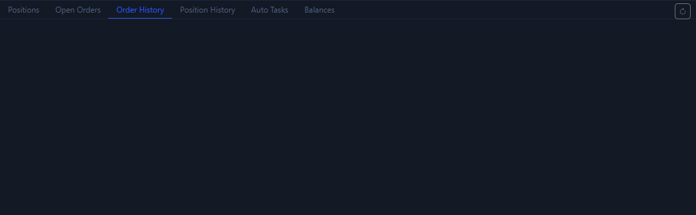

# Order History Tab

The `Order History` tab is the execution evidence page. It answers this question: did the order really go through the system, and what final state did it end up in?

## What this tab shows

- Historical orders that were submitted.
- Order side, price, quantity, status, and time.
- Exchange-specific history details.

## Why this tab matters

- A button message only proves that the UI received some response.
- Order history is usually what proves that the order really entered the system.
- When you suspect that an order did not succeed, this page is more reliable than intuition.

## Recommended usage

1. After placing an order, check positions or open orders first.
2. If the result does not match what you expected, go to order history immediately.
3. Reconcile the time, price, and side here against the action you just performed.

## What this tab is best for troubleshooting

- You clicked the order button, but no position appeared.
- A trigger order did not behave the way you expected.
- Whether an order was filled, canceled, or rejected.

Next, continue with [Position History Tab](position-history-tab.md) or [Manual Trading](manual-trading.md).