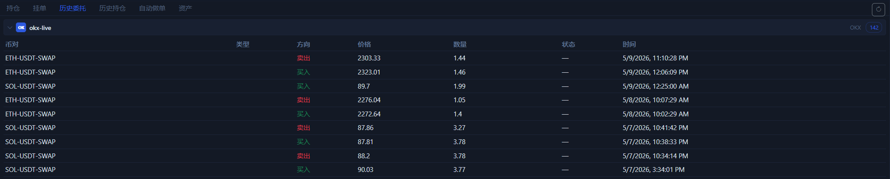

# 历史委托页

`历史委托` 页是“执行证据页”。它用来回答的是：订单到底有没有真正发出去，以及最后是以什么状态结束的。

## 这一页会显示什么

- 已提交过的历史订单记录。
- 订单方向、价格、数量、状态、时间。
- 不同交易所返回的历史明细。

## 为什么这页很重要

- 按钮提示只能说明 UI 收到了响应。
- 真正能说明“订单进过系统”的，通常还是历史委托记录。
- 当你怀疑一笔单没有下成功时，这里比主观感觉更可靠。

## 推荐使用方式

1. 下单后先看持仓或挂单。
2. 如果结果和预期不一致，再立刻看历史委托。
3. 用这里的时间、价格、方向回对你刚才的操作。

## 这页最适合排查什么

- 明明点了下单，但仓位没出现。
- 条件单好像没有按预期触发。
- 一笔单是否已经成交、撤销或被拒绝。

下一步建议看 [历史持仓页](position-history-tab.md) 或 [手动交易](manual-trading.md)。