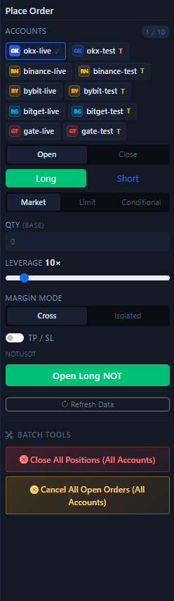

# Right Order Panel

The right order panel is the area in the entire UI where you need to operate most carefully. It is responsible for real order submission, and it also holds the batch cleanup tools.

## What this panel contains

- An account selector with multi-account support.
- `Open / Close` switching.
- `Long / Short` switching, or buy/sell direction in spot mode.
- `Market / Limit / Trigger` order type switching.
- Price, trigger price, quantity, leverage, and margin mode fields.
- A `TP / SL` toggle.
- The order submission button.
- A refresh data button.
- Bottom batch tools, such as one-click close and one-click cancel for open orders.

## Recommended first-time order of use

1. First confirm that the exchange, market type, and symbol on the left side are already correct.
2. Select a testnet account here.
3. Choose whether you are `opening` or `closing`.
4. Choose the direction.
5. Choose the order type.
6. Enter quantity, and only then set leverage and margin mode if needed.
7. Enable `TP / SL` when protection is required.
8. After submission, immediately verify the result from the bottom positions, orders, and history tabs.

## The easiest mistakes in this area

- Forgetting to check the currently selected account chips.
- Reversing `Open` and `Close`.
- Reversing `Long` and `Short`.
- Trying to use an order type that does not fit the current market type.
- Not understanding that quantity is currently entered in base-asset units.

## When to use the batch tools

- When cleaning up risk across multiple accounts at once.
- When you need to close all current positions quickly.
- When you need to cancel all currently open orders in one pass.

!!! warning "Batch tools usually have a wider blast radius"
    Always re-check the currently selected accounts before you execute. Mistakes here usually have a larger impact than mistakes on a single order.

Next, continue with [Positions Tab](positions-tab.md), [Open Orders Tab](open-orders-tab.md), and [Manual Trading](manual-trading.md).