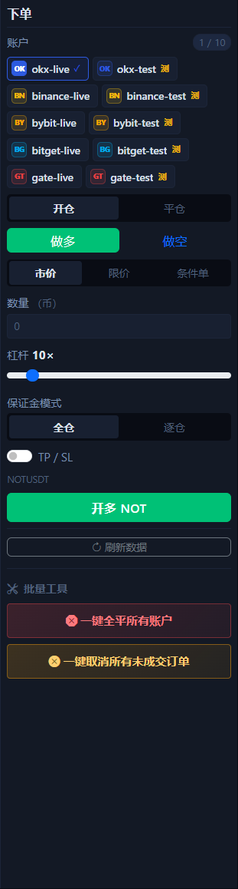

# 右侧下单面板

右侧下单面板是整个 UI 里最需要谨慎操作的区域。它负责真正发单，也负责批量清理。

## 这个面板包含什么

- 账户选择器，支持多选账户。
- `开仓 / 平仓` 切换。
- `做多 / 做空` 或现货买卖方向切换。
- `市价 / 限价 / 条件单` 类型切换。
- 价格、触发价、数量、杠杆、保证金模式。
- `TP / SL` 开关。
- 下单按钮。
- 刷新数据按钮。
- 底部批量工具，例如一键平仓、一键取消未成交订单。

## 第一次使用推荐顺序

1. 先确认左侧已经选对交易所、市场类型和交易对。
2. 在这里选中测试网账户。
3. 选择 `开仓` 还是 `平仓`。
4. 选择方向。
5. 选择订单类型。
6. 输入数量，必要时再设置杠杆和保证金模式。
7. 需要保护时打开 `TP / SL`。
8. 点击执行后，立刻去底部持仓、挂单和历史页核对结果。

## 这块最容易出错的地方

- 忘了看当前选中的账户芯片。
- 把 `开仓` 和 `平仓` 选反。
- 把 `做多` 和 `做空` 方向选反。
- 在错误的市场类型下尝试用不适用的订单类型。
- 没理解数量当前是按标的币数量输入。

## 批量工具什么时候用

- 多账户一起清理风险时。
- 需要快速平掉全部当前仓位时。
- 需要统一取消所有未成交订单时。

!!! warning "批量工具默认影响范围更大"
    执行前一定回看当前选中账户。这里的失误，通常比单笔下单的失误影响更大。

下一步建议看 [持仓页](positions-tab.md)、[挂单页](open-orders-tab.md) 和 [手动交易](manual-trading.md)。