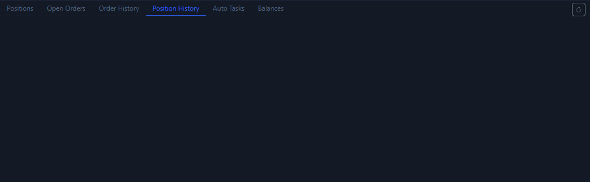

# Position History Tab

The `Position History` tab is about completed positions. It does not tell you “what is happening right now”, but rather “how much the last trade ultimately gained or lost”.

## What this tab shows

- The side of completed positions.
- Entry price and exit price.
- Quantity and final PnL.
- Closing time.

## When this tab is most useful

1. After a position has fully closed.
2. When you want to review the result of a past open/close sequence.
3. When you want to confirm whether a recent strategy is actually making or losing money.

## How it differs from the positions tab

- [Positions Tab](positions-tab.md) shows positions that are still alive.
- Position History shows positions that are already closed.
- The former is execution monitoring. The latter is review and statistics.

## Usage suggestions

- Confirm the final PnL here first, then go back to the chart to review the entry and exit zones.
- If you are practicing workflows in testnet, this page is the clearest result summary.

Next, continue with [Auto Trade Tab](auto-trade-tab.md) or [AI and Automation](ai-automation.md).