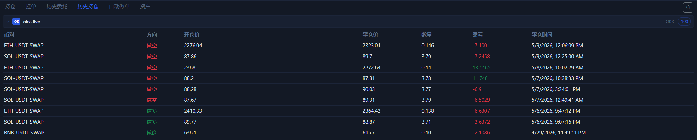

# 历史持仓页

`历史持仓` 页看的是已经结束的仓位结果。它不是“当前发生了什么”，而是“上一笔交易最后赚亏了多少”。

## 这一页会显示什么

- 已结束仓位的方向。
- 开仓价、平仓价。
- 数量和最终盈亏。
- 平仓时间。

## 这页适合什么时候看

1. 一笔仓位已经完全结束后。
2. 你想复盘某次开平仓结果时。
3. 你想确认某个策略最近到底是赚还是亏时。

## 和持仓页有什么区别

- [持仓页](positions-tab.md) 看当前还活着的仓位。
- 历史持仓页看已经关闭的仓位。
- 前者偏执行监控，后者偏复盘统计。

## 使用建议

- 先用这页确认最终盈亏，再结合图表回看入场和出场位置。
- 如果你在测试网练习流程，这一页是最直观的结果汇总页。

下一步建议看 [自动做单页](auto-trade-tab.md) 或 [AI 与自动化](ai-automation.md)。