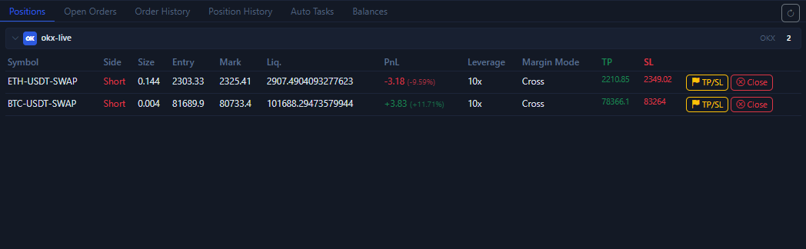

# Positions Tab

The `Positions` tab is your first place to confirm whether a position really opened.

## What you can see here

- Current positions grouped by account.
- The side, quantity, entry price, mark price, and liquidation price for each position.
- Unrealized PnL, leverage, and margin mode.
- Current TP / SL.
- Per-row quick buttons such as `TP/SL` and `Close`.

## When you must check this tab

1. Right after opening a position.
2. Right after changing TP / SL.
3. Before performing a rapid close.

## The most practical actions here

- Add protection to an existing position through the `TP/SL` button.
- End a single position quickly through the `Close` button.
- Confirm whether the current position is `Cross` or `Isolated`.

## If there is no data here, check these first

- Whether the left-side market type is set to the wrong `Spot / Swap` mode.
- Whether you switched to an exchange that has no open position.
- Whether you are looking at the wrong account group.
- Whether the order actually failed and you simply have not checked order history yet.

Next, continue with [Open Orders Tab](open-orders-tab.md) and [Order History Tab](order-history-tab.md).