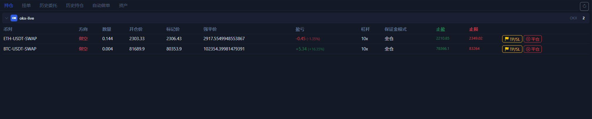

# 持仓页

`持仓` 页是你确认“仓位到底有没有真的开出来”的第一现场。

## 这一页能看到什么

- 按账户分组的当前持仓。
- 每笔仓位的方向、数量、开仓价、标记价、强平价。
- 未实现盈亏、杠杆、保证金模式。
- 当前 TP / SL。
- 每行自带的 `TP/SL` 和 `平仓` 快捷按钮。

## 什么时候一定要看这页

1. 你刚开完一笔仓位后。
2. 你刚修改完 TP / SL 后。
3. 你准备执行快速平仓前。

## 这页最实用的动作

- 通过 `TP/SL` 按钮给已有仓位加保护。
- 通过 `平仓` 按钮快速结束单笔仓位。
- 观察当前仓位到底是 `全仓` 还是 `逐仓`。

## 如果这里没有数据，先检查什么

- 左侧是不是选成了错误的 `现货 / 合约`。
- 当前是不是切到了没有仓位的交易所。
- 你看的是不是错误账户分组。
- 下单是否其实失败了，只是你还没去看历史委托。

下一步建议看 [挂单页](open-orders-tab.md) 和 [历史委托页](order-history-tab.md)。