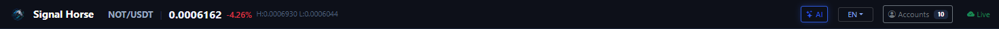

# Top Status Bar

The top status bar answers two questions: what you are currently looking at, and whether the local executor is currently reachable.

## What this bar contains

- The product identifier `TradeArk`.
- The current symbol, latest price, 24-hour change, and daily high / low.
- The `AI` button, which opens the AI model management window.
- The language switch button.
- The `Accounts` button, which opens the account management window.
- The online status indicator on the right, which tells you whether the local executor is reachable.

## The first 3 things to check when you open the UI

1. Whether the right-side status is online.
2. Whether there is an account count next to the `Accounts` button.
3. Whether the current symbol is actually the market you intended to inspect.

## The most common actions here

- Click `AI` to open model configuration and connection testing.
- Click `Accounts` to review saved accounts, add accounts, or batch-test them.
- Switch the language if another UI language is easier for you to use.

## Easy misunderstandings

- The top bar does not switch `spot / swap` for you. That happens in the left sidebar.
- The symbol shown in the top bar is only the current page context. It does not mean the right panel has already selected the correct account.
- The online status in the top-right corner only means the local executor is reachable. It does not mean the exchange is guaranteed to accept orders.

Next, continue with [Markets and Symbols Sidebar](market-sidebar.md) or [Account Center](account-center.md).