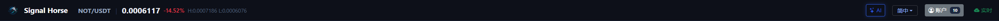

# 顶部状态栏

顶部状态栏负责回答两个问题：你当前在看什么，以及本地执行器当前是不是可用。

## 这一栏包含什么

- 产品标识 `TradeArk`。
- 当前交易对、最新价格、24 小时涨跌幅、高低点。
- `AI` 按钮，用来打开 AI 模型管理窗口。
- 语言切换按钮。
- `账户` 按钮，用来打开账户管理窗口。
- 右侧在线状态，用来判断本地执行器是否在线。

## 第一次打开时先看哪 3 件事

1. 右侧状态是不是在线。
2. `账户` 按钮旁边有没有账户数量。
3. 当前交易对是不是你要看的标的。

## 这里最常用的动作

- 点 `AI` 进入模型配置与连接测试。
- 点 `账户` 查看已保存账户、添加账户、批量测试账户。
- 切换语言，确认界面文本是否更适合你的使用习惯。

## 容易误解的点

- 顶部栏不会替你切换 `spot / swap`，这个动作在左侧侧栏里。
- 顶部栏显示的交易对只是当前页面上下文，不代表右侧已经选好账户。
- 右上角在线只代表本地执行器可访问，不代表交易所一定可下单。

下一步建议看 [市场与交易对侧栏](market-sidebar.md) 或 [账户管理窗口](account-center.md)。