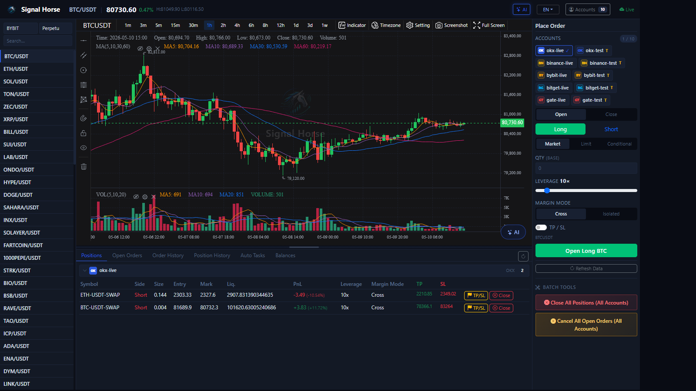

# UI Overview

This page only does one thing: it helps you build a mental map of the TradeArk UI before you jump into the feature-specific pages.

!!! tip "Understand the map before you operate"
    On your first use, do not rush into order placement. Match this overview against your own screen first, then learn each area step by step.

The current main UI can be understood as four regions:

1. Top status and entry bar
2. Left market and symbol sidebar
3. Center chart and AI analysis area
4. Bottom data tabs and the right order panel

## Read by function, not all at once

This chapter no longer puts every feature onto a single page. The directory is already split into “one area per page”, so you can jump directly to what you need:

- [Top Status Bar](top-bar.md)
- [Markets and Symbols Sidebar](market-sidebar.md)
- [Chart and Timeframe Tools](chart-workspace.md)
- [Bottom-Right AI Analysis](ai-chart-analysis.md)
- [AI Quick Order Modal](ai-quick-order.md)
- [One-Click Auto Trade](auto-trade-launcher.md)
- [Positions Tab](positions-tab.md)
- [Open Orders Tab](open-orders-tab.md)
- [Order History Tab](order-history-tab.md)
- [Position History Tab](position-history-tab.md)
- [Auto Trade Tab](auto-trade-tab.md)
- [Assets Tab](assets-tab.md)
- [Right Order Panel](order-panel.md)
- [Account Center](account-center.md)
- [AI Model Center](ai-model-center.md)

## Recommended sequence when you enter the UI for the first time

1. Check the online status and account count in the top-right area.
2. Use the left side to choose the correct exchange, market type, and symbol.
3. In the center area, confirm that the timeframe, chart, and price are updating normally.
4. Open the account window and verify which testnet account you want to use.
5. Complete one minimal order from the right-side panel.
6. Return to the bottom tabs to verify positions, orders, history, and assets.

!!! warning "The easiest mistakes are about context, not buttons"
    Most operating mistakes are not caused by clicking the wrong button. They happen because `spot / swap`, symbol, account, and side were not confirmed first.

Next, continue with [Top Status Bar](top-bar.md) and [Right Order Panel](order-panel.md).